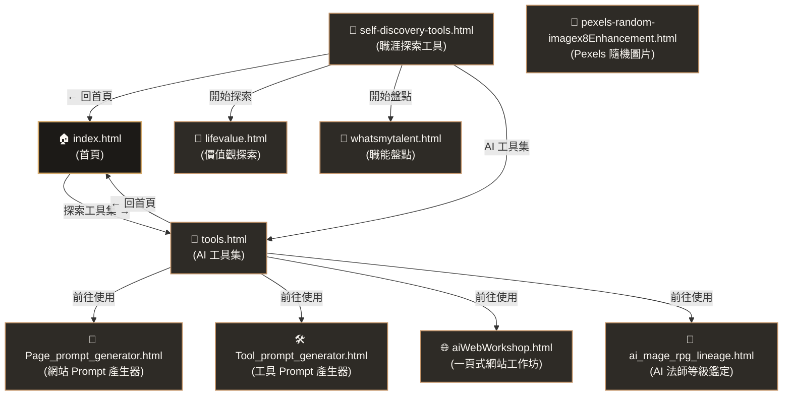

```mermaid
graph TD
    %% 主要節點
    index["🏠 index.html\n(首頁)"]
    tools["🔧 tools.html\n(AI 工具集)"]
    self["🧭 self-discovery-tools.html\n(職涯探索工具)"]
    lifevalue["💎 lifevalue.html\n(價值觀探索)"]
    whatsmytalent["🎯 whatsmytalent.html\n(職能盤點)"]
    page_prompt["📝 Page_prompt_generator.html\n(網站 Prompt 產生器)"]
    tool_prompt["🛠 Tool_prompt_generator.html\n(工具 Prompt 產生器)"]
    aiworkshop["🌐 aiWebWorkshop.html\n(一頁式網站工作坊)"]
    ai_mage["🧙 ai_mage_rpg_lineage.html\n(AI 法師等級鑑定)"]
    pexels["🎨 pexels-random-imagex8Enhancement.html\n(Pexels 隨機圖片)"]

    %% index.html 的連結
    index -->|"探索工具集 →"| tools
    %% tools.html 的連結
    tools -->|"← 回首頁"| index
    tools -->|"前往使用"| page_prompt
    tools -->|"前往使用"| tool_prompt
    tools -->|"前往使用"| aiworkshop
    tools -->|"前往使用"| ai_mage
    %% self-discovery-tools.html 的連結
    self -->|"← 回首頁"| index
    self -->|"開始探索"| lifevalue
    self -->|"開始盤點"| whatsmytalent
    self -->|"AI 工具集"| tools
    %% lifevalue.html 的連結
    %% (standalone tool, no internal nav links found)

    %% whatsmytalent.html 的連結
    %% (standalone tool, no internal nav links found)

    %% 樣式
    classDef main fill:#1c1a17,color:#faf7f2,stroke:#d4a96a,stroke-width:2px
    classDef tool fill:#2e2b26,color:#faf7f2,stroke:#c4956a,stroke-width:1.5px
    class index main
    class tools,self tool
    class lifevalue,whatsmytalent,page_prompt,tool_prompt,aiworkshop,ai_mage,pexels tool
```